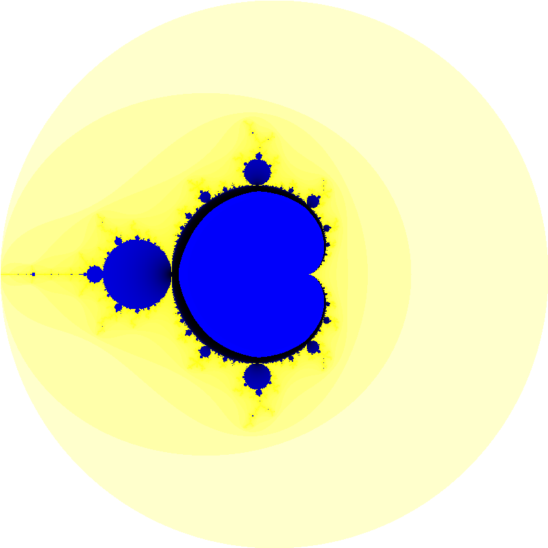
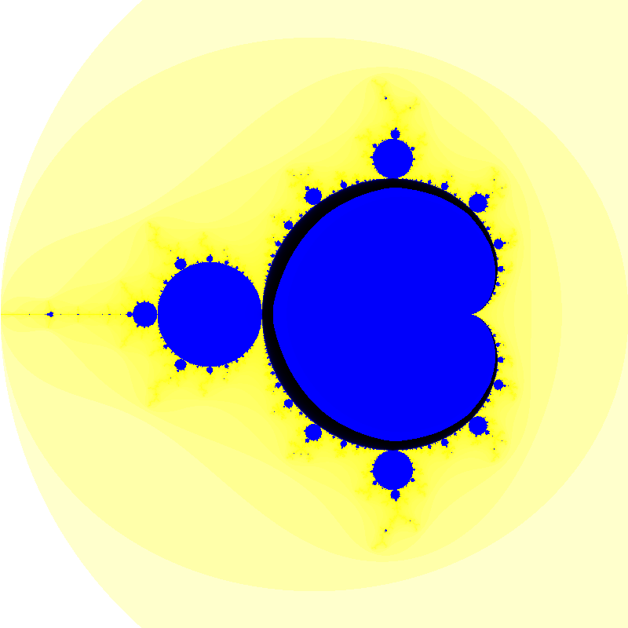

# Interactive Mandelbrot set

This is a basic c++ implimentation of generating the Mandelbrot set. It supports zooming, panning and reseting back to the original view.

It does not currently use GPU acceleration, which would make it less portable to other platforms. This is still a goal.

## Requirements

- C++ 17
- SDL2 and SDL2_image
- CMake

## compiling

to compile, create a build folder, run 'cmake ..' and then 'make'.
Run with './Mandelbrot'.

## App controls
- click to zoom in at mouse position.
- Space bar to zoom out at mouse position.
- Arrow keys to pan.
- r key to reset

## License
### [GPL3](license.txt)

